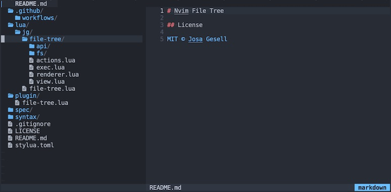

# Nvim File Tree



<!--
## Features

- No configuration
- No dependencies
- Synced across tabs
- Git status
-->

## Installation

```viml
Plug 'josa42/nvim-file-tree'
```

## Setup

```lua
vim.api.nvim_set_keymap('n', '<leader>t', ':lua require("file-tree").toggle_smart()<CR>', {})
```

## License

[MIT © Josa Gesell](LICENSE)
